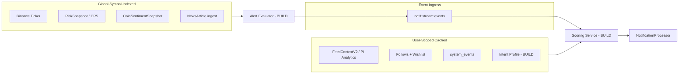
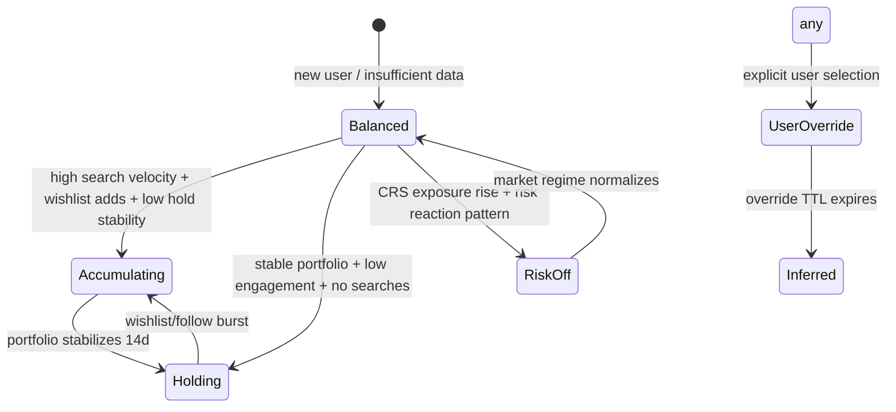
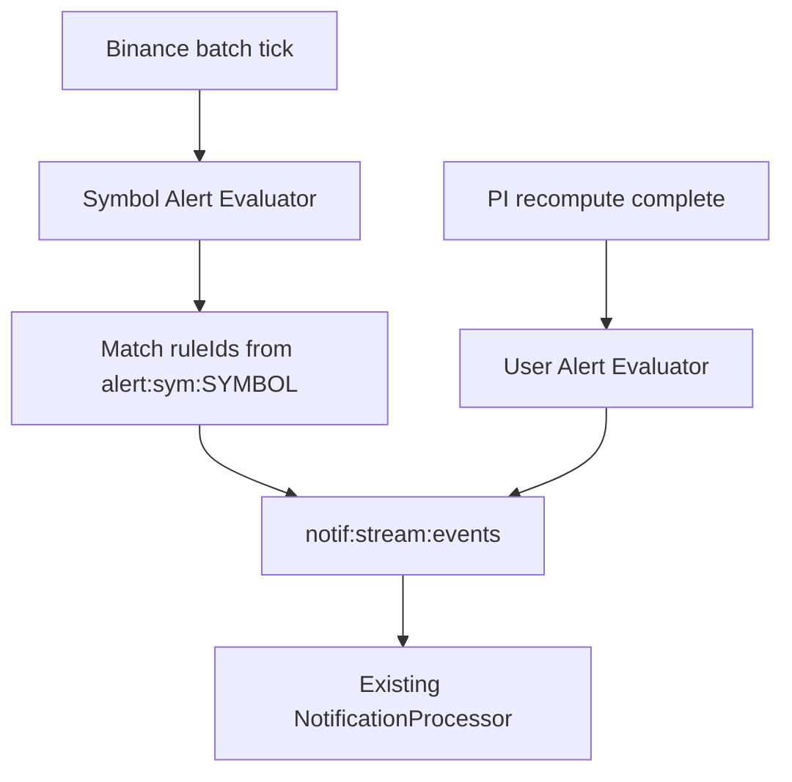
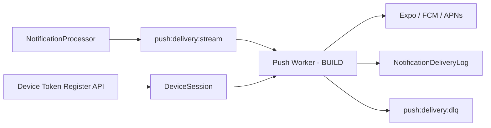
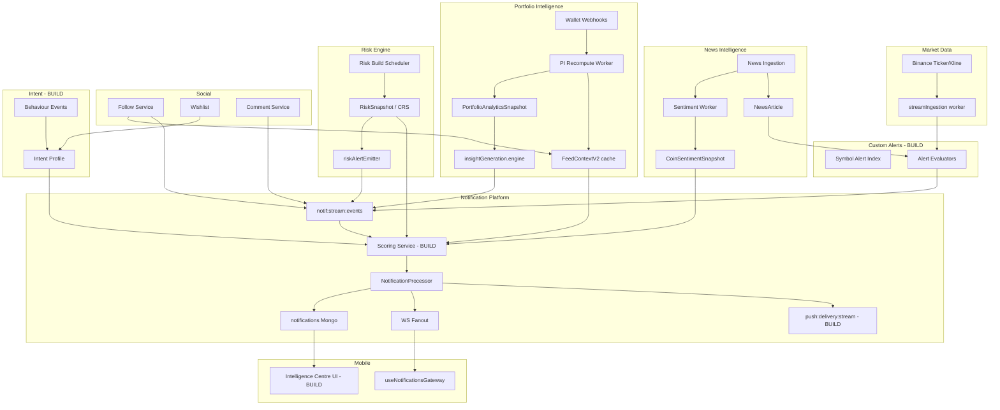

# NAYFT Notification Intelligence Platform — Architecture Blueprint Audit

**Type:** Architecture validation (not code audit, not implementation)  
**Basis:** Prior readiness audit + verified NAYFT infrastructure  
**Verdict premise:** The platform *can* be built scalably on current foundations, but only if intelligence layers are added incrementally and several v2 assumptions are challenged.

---

## Executive Architecture Verdict (Preview)

| Metric | Score |
|--------|-------|
| **Current state** | 38 / 100 |
| **After Phase A (Foundation)** | 52 / 100 |
| **After Phase B (Push + In-App complete)** | 65 / 100 |
| **After Phase C (Intelligence layer)** | 78 / 100 |
| **After Phase D (Personalization)** | 86 / 100 |

The existing Redis Streams → Processor → Mongo → WS pipeline is the correct spine. v2 fails if treated as a greenfield platform. It succeeds if intelligence is layered onto proven patterns already used by Portfolio Intelligence, sentiment, and risk workers.

---

# Deliverable 1 — Notification Scoring Architecture Blueprint

## 1.1 Input Signal Inventory

Every signal below is traced to verified code. Gaps are marked explicitly.

| Signal Category | Source | Location | Availability | Latency | Notes |
|-----------------|--------|----------|--------------|---------|-------|
| **Portfolio holdings** | PI positions + context | `piRead.service.ts`, `PortfolioPosition.ts` | Per-user, Redis-cached (`feed:context:{userId}:v2`) | Seconds–minutes | `stale` / `staleMapping` flags exist |
| **Portfolio weights** | `weightBySymbol` | `PortfolioContextDto` | Cached | Same as above | Direct relevance input |
| **PI insights** | Rule-generated insights | `insightGeneration.engine.ts` | Post-recompute | Minutes | Priority formula already exists (`severityWeight × log(exposure)`) |
| **Narrative vector** | PI analytics | `FeedContextV2.narrativeVector` | Cached | Minutes | Used client-side in feed only today |
| **Conviction vector** | PI analytics | `FeedContextV2.convictionVector` | Cached | Minutes | Same |
| **Health score** | PI analytics | `FeedContextV2.healthScore` | Cached | Minutes | Nullable |
| **Followed assets** | Follow model | `follow/model.ts` | Real-time | Immediate | Coin + user targets |
| **Wishlist assets** | Wishlist model | `wishlist/model.ts` | Real-time | Immediate | Interest signal, not held |
| **Risk (CRS)** | Risk engine | `RiskSnapshot`, `riskAlertEmitter.ts` | Per-symbol, build cron | 15min–hours (config-dependent) | Symbol-scoped, not user-scoped today |
| **CRS delta / jumps** | Risk alerts | `RiskAlert.ts` | Per build | Same | Threshold: delta > 0.12 |
| **Market regime** | Risk engine | `regimeDetector.ts` | Global | Build cycle | elevated / panic / low_risk |
| **Coin sentiment** | Sentiment aggregator | `CoinSentimentSnapshot.ts` | Per-symbol | ~15min cron | bullish/bearish/risk ratios |
| **News articles** | News ingestion | `NewsArticle.ts` | Global | Real-time ingest | coins[], sentimentAnalysis, source trust |
| **News engagement** | Reactions | `reaction/model.ts` | Per-article | Real-time | insightful, risk, bullish, etc. |
| **News interactions** | User saves/likes | `UserNewsInteraction.ts` | Per-user | Real-time | viewed, saved, liked |
| **User activity** | Analytics bus | `system_events`, `eventRegistry.ts` | Per-user | Near-real-time | article_opened, source_viewed (client) |
| **Search intent** | Feed intent store | `useFeedIntentStore.ts` | **Client-only today** | Local | Must be promoted server-side |
| **Read history** | Feed intent store | `useFeedIntentStore.ts` | **Client-only today** | Local | Max 30 article IDs |
| **Wallet activity** | Wallet events | `WalletEvent.ts`, aggregator | Per-user | Webhook-driven | Transfer detection exists |
| **Price / 24h change** | Binance ticker | `binanceTickerIngestion.ts` → `stream:prices:batch` | Per-symbol | Sub-second | Pub/sub, not persisted long-term |
| **MIU narrative intelligence** | MIU service | `MIU/app/schemas/miu_schema.py` | Per-asset | **Unknown — requires validation** | Separate Python service, not wired |
| **Narrative engine (offline)** | news-intelligence-lab | Python pipeline | **Not in production path** | Offline | risk/opportunity/neutral labels |
| **Whale / large tx events** | — | — | **Not verified** | — | Wallet events exist; whale classification unknown |
| **Notification engagement** | — | — | **Missing** | — | No feedback model |

### Signal Architecture Diagram



**Design principle:** Separate **symbol-indexed evaluation** (alerts, market triggers) from **user-indexed scoring** (relevance ranking). Mixing them in one synchronous path is the primary scaling mistake to avoid.

---

## 1.2 Scoring Framework Design

### Score composition

Proposed composite score (0–1000 scale, clamped):

```
finalScore = clamp(
  w_portfolio  × portfolioRelevance
+ w_intent     × intentAlignment
+ w_time       × timeSensitivity
+ w_source     × sourceCredibility
+ w_affinity   × userAffinity
+ w_engagement × historicalEngagement
+ w_novelty    × noveltyFactor
+ w_risk       × riskImpact
+ w_opportunity× opportunityImpact
+ basePriority
, 0, 1000)
```

### Factor definitions and data sources

| Factor | Computation | Primary source | Static / Config / Learned |
|--------|-------------|----------------|---------------------------|
| **Portfolio relevance** | `heldWeight × symbolMatch × mappingConfidence` | `PortfolioContextDto`, event body symbols | **Configurable** weights; formula static |
| **Intent alignment** | Mode-specific multiplier on category/type | Intent profile (BUILD) | **Configurable** per mode |
| **Time sensitivity** | Exponential decay on event age; breaking-news boost | Event timestamp, news flags | **Static** half-life; **configurable** boost |
| **Source credibility** | Source trust tier + sentiment confidence | `NewsArticle.source.trustCategory`, PI confidence | **Static** tier map |
| **User affinity** | Follow + wishlist + recent search overlap | Follow, wishlist, intent profile | **Learned** long-term; **configurable** short-term |
| **Historical engagement** | Category/type open-rate, dismiss-rate | NotificationFeedback (BUILD) | **Learned** |
| **Novelty** | Dedupe recency inverse; same-groupKey penalty | Redis dedupe keys, `groupKey` | **Static** |
| **Risk impact** | CRS level × delta × held exposure | RiskSnapshot, portfolio weights | **Configurable** |
| **Opportunity impact** | Sentiment shift × narrative alignment × conviction | CoinSentiment, narrative vector | **Configurable**; ML later |

### Static vs configurable vs learned

| Phase | Approach |
|-------|----------|
| **Phase B–C (launch)** | Port proven weights from `feedPriority.service.ts` (followBoost 120, crsMax 35, recencyHalfLife 18h, heldBoostMax 80, narrativeBoostMax 60). These are battle-tested on the feed. |
| **Phase C (6–12 months)** | Admin-configurable weight bundles via feature registry metadata (same pattern as PI formula registry). |
| **Phase D+ (12+ months)** | Learned affinity/engagement from feedback loop. Do **not** start with ML scoring — insufficient notification feedback data exists today. |

### Scoring placement in pipeline

```
Event → Rule match (who receives?) → Scoring (how important?) → Preference filter → Dedupe/throttle → Materialize
```

**Recommendation:** Scoring runs **after recipient resolution, before materialization**, as an extension of `NotificationProcessor` — not a separate microservice until >100K DAU with profiling evidence of CPU bottleneck.

**Tradeoff:** In-process scoring keeps latency low and avoids new infra. Risk: processor CPU growth. Mitigation: dedicated worker process (already recommended in readiness audit), context cache, score short-circuit for BULK/digest items.

### Reuse opportunity

| Existing asset | Reuse strategy |
|----------------|----------------|
| `feedPriority.service.ts` weights | **Refactor** → server-side `NotificationScoringService` |
| PI insight priority formula | **Reuse** for insight-category notifications |
| `insightGeneration.engine.ts` | **Reuse** as producer, not re-evaluator |
| `FeedContextV2` Redis cache | **Extend** with scoring snapshot TTL |

---

## 1.3 Scaling Analysis — Scoring

**Assumptions (explicit):**
- 30% DAU, 5 scored events/active user/day
- Scoring with warm context cache: ~5ms CPU
- Cold context fetch (PI + follow + sentiment lookup): ~50–150ms
- 90% cache hit rate at steady state

| Scale | Events/day | Scoring ops/day | Redis reads/day | Mongo reads/day (cold) | Bottleneck |
|-------|------------|-----------------|-----------------|------------------------|------------|
| **1K users** | ~1.5K | Trivial | ~15K | ~150 | None |
| **10K users** | ~15K | Trivial | ~150K | ~1.5K | None |
| **100K users** | ~150K | ~1.7/sec avg, ~50/sec peak | ~1.5M | ~15K | Context cache miss storm on deploy |
| **1M users** | ~1.5M | ~17/sec avg, ~500/sec peak | ~15M | ~150K | Processor CPU; single-stream head-of-line blocking |

### Bottleneck identification

| Layer | 100K | 1M | Mitigation |
|-------|------|-----|------------|
| **Compute** | OK with dedicated worker | Risk | Extract worker; batch context prefetch; short-circuit low-priority |
| **Redis** | OK | Memory for context + dedupe | Shared context key per user; dedupe TTL tiering |
| **Mongo** | OK | Read amplification on cold scoring | Mandatory Redis context snapshot; never score from full PI recompute |
| **Storage** | N/A for scoring | N/A | Scores ephemeral — persist only in notification record as `score` field |

### Cost implications

At 1M users, scoring adds ~$50–150/month in compute (2–4 dedicated worker instances) if properly cached. Without caching, cost jumps 5–10× due to Mongo/PI reads.

---

## 1.4 Failure Analysis — Scoring

| Failure | Behaviour | Degradation strategy |
|---------|-----------|---------------------|
| **Scoring service error** | Do not block delivery | Fall back to `RuleEvaluator` static priority (current behaviour) |
| **Context cache miss + PI unavailable** | Cannot compute portfolio/intent factors | Score with available global factors (time, source, risk symbol-level); flag `data.partial=true` in notification |
| **Portfolio data stale** | `PortfolioContextDto.stale=true` | Reduce portfolio weight 50%; prefer follow/wishlist signals |
| **Portfolio mapping stale** | `staleMapping=true` | Zero out held-weight factor; log metric |
| **Risk data unavailable** | No CRS for symbol | Zero risk factor; do not suppress notification |
| **Sentiment unavailable** | Missing snapshot | Zero opportunity factor |
| **Intent profile missing** | New user | Default to **Balanced** mode with neutral multipliers |
| **All factors zero** | Edge case | Use `basePriority` from rule; minimum score floor of 100 for CRITICAL types |

**Principle:** Scoring modulates delivery timing and channel — it must never be a hard gate except for sub-threshold BULK items destined for digest.

---

# Deliverable 2 — Intent Mode Architecture Blueprint

## 2.1 Mode Architecture

### Supported modes

| Mode | Intent | Notification bias |
|------|--------|-------------------|
| **Accumulating** | Active buying / researching | Boost opportunity, wishlist, narrative; suppress noise |
| **Holding** | Passive hold | Suppress price noise; boost portfolio risk, major moves only |
| **Risk-Off** | Capital preservation | Boost risk alerts, CRS jumps; suppress bullish/opportunity |
| **Balanced** | Default | Neutral weights (current feed explore behaviour) |

### Data model (proposed — new component justified)

Extend existing infrastructure rather than invent a parallel system:

```
user_intent_profiles (Mongo — BUILD NEW collection)
├── userId (unique)
├── activeMode: accumulating | holding | risk_off | balanced
├── modeSource: user_selected | inferred | default
├── modeConfidence: 0.0–1.0
├── inferredAt: Date
├── userOverrideUntil?: Date   // snooze auto-inference
├── signalSnapshot: {         // last inference inputs (for debug)
│     portfolioDrift, searchVelocity, riskReactionRate, ...
│   }
├── version: number
└── updatedAt
```

**Why not `NotificationPreference`?** Intent is behavioural state, not a delivery preference. Mixing them creates coupling and complicates preference inheritance already defined in the RFC.

**Why not client-only `useFeedIntentStore`?** Push notifications and server-side scoring require server authority. Client store becomes a sync target, not source of truth.

### State transitions



**Persistence strategy:**
- Mongo as source of truth
- Redis cache `intent:profile:{userId}` TTL 1h
- Recompute on: portfolio webhook, follow/wishlist change, notification feedback batch (daily), explicit user change
- Do **not** recompute on every notification event

---

## 2.2 Behavioural Inference — Signal Audit

| Signal | Exists today? | Location | Server-side? | Action |
|--------|---------------|----------|--------------|--------|
| Portfolio changes | ✅ | Wallet events, PI recompute triggers | ✅ | **Reuse** |
| Wishlist additions | ✅ | `wishlist/model.ts` | ✅ | **Reuse** — emit intent signal event |
| Follow actions | ✅ | `follow/service.ts` | ✅ | **Reuse** |
| Notification engagement | ❌ | — | — | **Build** — NotificationFeedback |
| Search activity | ⚠️ Partial | `useFeedIntentStore.ts` | ❌ Client only | **Build** — sync via `POST /events` or dedicated endpoint |
| Reading activity | ⚠️ Partial | Client store + `news_feed:article_opened` | Partial | **Extend** event bridge |
| News reactions | ✅ | `reaction/model.ts` | ✅ | **Reuse** — risk vs bullish ratio as signal |
| Portfolio concentration drift | ✅ | PI analytics payload | ✅ | **Reuse** |
| Verification/onboarding | ✅ | Coin onboarding | ✅ | Initial mode hint: Accumulating |

---

## 2.3 Inference Model Recommendation

**Recommended: Hybrid (rules + weighted scoring)**

| Approach | Fit | Verdict |
|----------|-----|---------|
| Pure rule-based | Explainable, shippable fast | Good for v1 mode assignment |
| Pure ML | No training data | **Reject for launch** |
| Weighted scoring | Matches feed orchestrator pattern | **Primary engine** |
| Hybrid | Rules set boundaries; scoring picks mode | **Recommended** |

### Hybrid algorithm (conceptual)

1. If user explicitly set mode and override active → use it (confidence 1.0)
2. If insufficient data (<7 days activity, no portfolio) → **Balanced** (confidence 0.3)
3. Compute signal vector from available server-side signals
4. Apply mode decision rules:
   - `riskOffScore > 0.6` → Risk-Off
   - `accumulatingScore > 0.5 AND holdingScore < 0.3` → Accumulating
   - `holdingScore > 0.5 AND searchVelocity < threshold` → Holding
   - Else → Balanced
5. Require **hysteresis**: mode change only if new mode wins by ≥0.15 margin for 48h (prevents flicker)

**Tradeoff:** Hysteresis delays responsiveness but prevents notification whiplash — critical for trust.

---

## 2.4 Failure Modes — Intent

| Condition | Recovery |
|-----------|----------|
| **Insufficient data** | Balanced mode, confidence 0.3, suppress intent-weighted scoring >±20% |
| **Conflicting signals** (buying + risk-off reactions) | Balanced; boost CRITICAL risk regardless of mode |
| **Rapid behaviour change** | Hysteresis window; don't shift mode more than once per 48h |
| **Stale portfolio** | Freeze portfolio-derived signals; rely on follow/search |
| **Personalization disabled** | `personalization_globally_disabled` switch → force Balanced, zero intent factor (already exists in PI) |

---

# Deliverable 3 — Custom Alert Architecture Blueprint

## 3.1 User Alert Architecture

Custom alerts are the highest-risk v2 component if implemented naïvely (per-user polling). The architecture must invert the evaluation graph.

### Alert types and feasibility

| Alert type | Trigger source (verified) | Evaluation model |
|------------|---------------------------|------------------|
| **Price alerts** | `stream:prices:batch` | Symbol-indexed threshold check |
| **Percentage change** | Binance ticker `percentChange24h` + kline history | Symbol-indexed |
| **Volume alerts** | Kline/aggTrade in Mongo (`streamIngestion.ts`) | Symbol-indexed aggregation |
| **Whale alerts** | Wallet events | **Unknown — requires validation** of whale classification |
| **Portfolio alerts** | PI insights, holdings delta | User-indexed, event-driven (PI fanout) |
| **Narrative alerts** | PI narrative vector shifts, news sentiment | User-indexed + symbol-indexed hybrid |

### Data model — extend existing schema

**Reuse `NotificationRule` with extended condition vocabulary:**

```
NotificationRule (EXISTING — wire and extend)
├── scope: user | segment | global
├── eventType: market.price | market.volume | portfolio.insight | narrative.shift | ...
├── conditions: {
│     symbols: string[]           // empty = watchlist-derived
│     operator: gt | lt | crosses | pct_change
│     threshold: number
│     windowSec?: number
│     repeatPolicy: once | cooldown | every_match
│     cooldownSec?: number
│   }
├── actions: {
│     category, type, priorityFloor, channels[]
│   }
├── priority: number              // conflict resolution
└── enabled: boolean
```

Add companion index collection for scale:

```
alert_subscriptions (BUILD NEW — inverted index)
├── symbol: string                // uppercase
├── ruleIds: string[]             // or Redis SET per symbol
├── userId: string
└── updatedAt
```

**Justification for new index:** Mongo query `{ conditions.symbols: "BTC" }` across 10M rules is not viable. Inverted index is mandatory at scale. Redis `SET alert:sym:BTC → ruleId[]` matches existing symref pattern in price WS.

---

## 3.2 Event Processing Design

**Recommended: Hybrid**

| Alert class | Model | Why |
|-------------|-------|-----|
| Price / volume / CRS | **Event-driven, symbol-indexed** | Market data already flows as pub/sub batches; evaluate once per symbol per tick, fan out to subscribers |
| Portfolio / PI | **Event-driven, user-indexed** | PI recompute and wallet webhooks already emit events |
| Narrative / news | **Event-driven on ingest** | News ingestion already triggers sentiment queue |
| Periodic restatement (daily summary) | **Scheduled** | Digest job pattern |

**Reject pure polling** except as **reconciliation safety net** (hourly missed-alert scan). Polling 1M users × 10 alerts = 10M evaluations/minute — not feasible.



---

## 3.3 Scaling Analysis — Custom Alerts

**Assumptions:** 30% users create alerts; evaluation is symbol-indexed for market alerts.

| Alerts/user | 10K users | 100K users | 1M users |
|-------------|-----------|------------|----------|
| **1** | 3K rules, trivial | 30K rules, trivial | 300K rules, OK with Redis index |
| **10** | 30K rules, OK | 300K rules, OK | 3M rules, Redis memory ~500MB for indexes |
| **50** | 150K rules, OK | 1.5M rules, index rebuild cost | 15M rules, **needs sharding by symbol hash** |
| **100** | 300K rules, monitor eval latency | 3M rules, dedicated alert worker | 30M rules, **likely over-engineered for product** — cap at 25/user |

### Feasibility verdict

| Scale | Max alerts/user (recommended) | Notes |
|-------|-------------------------------|-------|
| 10K | 50 | Fully feasible on current infra |
| 100K | 25 | Dedicated alert evaluator worker required |
| 1M | 10–15 (soft cap) | Hard cap with premium tier above; symbol index sharding |

**Over-engineering risk:** Supporting 100 alerts/user at 1M scale without caps implies ~100M active rules — product and infra cost unlikely to justify. **Recommend tiered limits** early.

---

## 3.4 Conflict Resolution

| Conflict | Resolution policy |
|----------|-------------------|
| **Custom vs system alert (same event)** | Higher `priority` wins; merge into single notification with `groupKey`; system CRITICAL never suppressed by custom |
| **Duplicate events** | Existing `DedupeGuard` + rule-level `dedupeHash`; custom rules inherit same layer |
| **Priority upgrade** | If custom alert fires with higher score than existing unread in same `groupKey`, patch priority (WS `notification:update`) |
| **Alert suppression** | User snooze (`snoozedUntil` on rule or category); intent mode suppression for non-critical; quiet hours |
| **Contradictory signals** | MIU `contradiction` flag (when integrated) → downgrade to Intelligence Centre feed only, no push |

Layer order (aligns with v2 push layers):

```
L0 Intent Mode → L1 Event → L2 Scoring → L3 Dedupe → L4 User Thresholds → L5 Delivery → L6 Feedback
```

Custom alerts enter at L1; system rules and custom rules share L2–L6.

---

# Deliverable 4 — Intelligence Centre Architecture Blueprint

## 4.1 Information Architecture Validation

Proposed categories:

| Category | Sufficient? | Verdict |
|----------|-------------|---------|
| **Insight** | ✅ | Maps to PI insights, MIU intelligence |
| **Risk** | ✅ | Maps to RiskAlert, CRS, portfolio risk insights |
| **Opportunity** | ✅ | Maps to sentiment shifts, narrative alignment, MIU direction |
| **Context** | ⚠️ | Overlaps with Insight; use for ambient/portfolio state, not actionable alerts |
| **Daily Brief** | ✅ | Digest composite |

**Recommended addition:** **Activity** (social, wallet, security) — already exists as notification categories (`security`, `portfolio`, `social`). Intelligence Centre should not absorb transactional notifications.

**Final taxonomy:**

| Tab / filter | Content | Push eligible? |
|--------------|---------|----------------|
| Intelligence | Insight, Risk, Opportunity | Yes (scored) |
| Context | Portfolio state, regime, brief headers | No (in-app only) |
| Activity | Wallet, social, security | Yes (existing rules) |
| Daily Brief | Aggregated digest | Scheduled push |

---

## 4.2 Data Model

**Recommendation: Extend `notifications` collection — do not build parallel feed store.**

Add fields to existing model:

```
notifications (EXTEND existing)
├── intelCategory?: insight | risk | opportunity | context | brief
├── intelEntityId?: string        // PI insight id, RiskAlert dedupeKey, etc.
├── severity?: info | warning | critical
├── confidence?: number
├── actionType?: open_asset | open_article | review_portfolio | dismiss
├── snoozedUntil?: Date
├── savedAt?: Date                // bookmark
├── expiresAt?: Date             // already have expireAt
└── score?: number                // materialized scoring output
```

**New collection only for user state overlays:**

```
notification_user_state (BUILD NEW — lightweight)
├── userId + notificationId (compound unique)
├── saved: boolean
├── snoozedUntil?: Date
└── feedbackType?: dismissed | helpful | not_relevant
```

**Why separate user state?** Keeps notification documents immutable for audit; snooze/save are user-specific views on shared intelligence (future: shared market insights).

### Expiry management

| Category | Default TTL | Rationale |
|----------|-------------|-----------|
| Insight | 30 days | Portfolio state changes |
| Risk | 14 days | CRS decays |
| Opportunity | 7 days | Time-sensitive |
| Context | 3 days | Ambient |
| Daily Brief | 90 days | Reference |
| Activity | 90 days | Existing RFC |

Use Mongo TTL index on `expireAt` (partial indexes per category).

---

## 4.3 Feed Ranking Recommendation

**Recommended: Hybrid (relevance primary, time secondary)**

Within Intelligence Centre:

1. Filter by tab (`intelCategory`)
2. Exclude snoozed, expired, deleted
3. Sort by `score DESC, createdAt DESC`
4. Apply attention budget (reuse pattern from `attentionBudget.service.ts`) — max 5 HIGH visibility items per session

**Reject pure chronological** — contradicts v2 intelligence premise.  
**Reject pure relevance** — users lose trust without recency tie-break.

Unread badge count remains global across all tabs (existing Redis counter).

---

## 4.4 Retention & Storage Growth

**Assumptions:** 8 intelligence items/user/week, 2KB avg document, 50% users active.

| Scale | Intel items/month | Mongo storage/month | 12-month hot storage |
|-------|-------------------|---------------------|----------------------|
| **10K users** | ~20K | ~40MB | ~480MB |
| **100K users** | ~200K | ~400MB | ~4.8GB |
| **1M users** | ~2M | ~4GB | ~48GB |

Plus indexes (~2×) → ~100GB at 1M users/year.

**Archival strategy (reuse RFC intent):**
- Hot: `notifications` 90 days
- Warm: `notifications_archive_{YYYYMM}` monthly collections
- Cold: S3/object storage for compliance export (account deletion pattern already exists)
- Delivery logs: 30–90 day TTL (schema already defines this)

**Cost:** Mongo storage ~$25–80/month at 1M users with archival; manageable if TTL enforced.

---

# Deliverable 5 — Push Infrastructure Blueprint

## 5.1 Provider Strategy Comparison

| Provider | Pros | Cons | NAYFT fit |
|----------|------|------|-----------|
| **Expo Notifications** | App is Expo (`crypto-market`); fastest MVP; abstracts FCM+APNs | Vendor dependency; less control; token lifecycle via Expo | **Best MVP** |
| **FCM direct** | Free tier generous; Android control | No iOS; separate APNs needed | Growth stage Android |
| **APNs direct** | iOS control, reliability | Apple cert complexity; no Android | iOS-only fallback |
| **React Native Firebase** | Full control; unified API; production-grade | Native module complexity; ejecting concerns | Enterprise scale |

### Recommendations by stage

| Stage | Strategy | Justification |
|-------|----------|---------------|
| **MVP (Phase B)** | **Expo Notifications** | Zero push code exists; `google-services.json` present; `DeviceSession.pushToken` ready |
| **Growth (100K+)** | **Expo + direct FCM for Android high-volume** | Cost/latency optimization on Android (~70% of crypto users typically) |
| **Enterprise (1M+)** | **RN Firebase Messaging + APNs HTTP/2** | Token rotation control, delivery analytics, provider failover |

**Challenge:** Expo adds ~50–100ms relay latency and Expo outage dependency. Acceptable until ~500K DAU.

---

## 5.2 Delivery Architecture



### Component design

| Component | Decision | Basis |
|-----------|----------|-------|
| **Token registration** | `POST /device-sessions` → `DeviceSession.ts` | Schema exists; no API today |
| **Token rotation** | Upsert on `userId+deviceId`; invalidate stale tokens on 410 Gone from provider | Industry standard |
| **Delivery queue** | Redis Stream `push:delivery:stream` | Matches notification/sentiment/PI pattern |
| **Retry logic** | 3 attempts, exponential backoff (reuse email worker pattern) | `emailWorker.ts` proven |
| **Failure tracking** | Write `NotificationDeliveryLog` | Schema exists, unused |
| **Priority lanes** | CRITICAL on high-priority stream (mirror PI dual-stream) | PI pattern reuse |

### Push decision gate

Push only when:
1. User has active push token
2. `channelPrefs.push.enabled !== false`
3. Not in quiet hours
4. Score ≥ channel threshold OR priority = CRITICAL
5. Not snoozed

In-app + WS always attempted regardless (existing path).

---

## 5.3 Cost Analysis — Push

**Assumptions:** 30% DAU, 3 push-eligible notifications/user/day, 40% delivered via push (rest in-app only).

| Scale | Push/day | Push/month | FCM/Expo cost | Push worker compute |
|-------|----------|------------|---------------|---------------------|
| **10K users** | ~3.6K | ~108K | **$0** (free tiers) | Negligible |
| **100K users** | ~36K | ~1.08M | **$0–50** | ~$30–80/mo (1 worker) |
| **1M users** | ~360K | ~10.8M | **$0–200** (FCM free; Expo may charge at scale) | ~$150–400/mo (2–4 workers) |

FCM is free; primary cost is compute and Mongo delivery logs, not per-message fees.

**Hidden cost:** Apple Push Notification service requires valid provisioning — operational, not per-message.

---

# Deliverable 6 — Dependency Graph Report



### Dependency table

| Source | Consumer | Failure impact | Fallback |
|--------|----------|----------------|----------|
| Binance ticker | Alert evaluator, price WS | Price alerts delayed | Last-known price + stale flag; pause threshold alerts |
| News ingestion | Sentiment, alert eval | Narrative alerts delayed | Continue with existing sentiment snapshots |
| Sentiment worker | Scoring, alerts | Opportunity score degraded | Zero opportunity factor |
| PI recompute | Insights, context, portfolio alerts | Portfolio intelligence stale | Serve cached FeedContextV2 with `stale=true`; reduce scores |
| Risk build | CRS alerts, scoring | Risk alerts stop | Use last RiskSnapshot revision; mark alerts as stale |
| Follow/wishlist | Scoring, targeting | Reduced relevance | Portfolio-only targeting |
| Intent profile | Scoring, suppression | Neutral mode | Balanced defaults |
| Notification stream | Processor | **Total delivery halt** | DLQ replay; XAUTOCLAIM (exists) |
| Redis pub/sub | WS fanout | Real-time broken; REST works | Client `sinceSeq` reconciliation (exists) |
| Push provider | Offline delivery | No push; in-app works | Queue retries; DLQ for ops |
| MIU service | Contradiction filter | No contradiction downgrade | Pass-through all signals |
| Feature registry | All modules | Feature disabled | Kill switch (exists for `notifications`) |

**Critical path:** `notif:stream:events` → Processor → Mongo. Everything else is enhancement layer.

---

# Deliverable 7 — Notification Economics Report

## 7.1 Cost Drivers

| Driver | Dominant at scale? | 10K | 100K | 1M |
|--------|-------------------|-----|------|-----|
| **Push delivery compute** | Medium | $5 | $50 | $300 |
| **Redis memory** (streams, dedupe, context, alert index) | High | $20 | $80 | $400 |
| **Mongo storage** (inbox + logs) | Medium | $15 | $60 | $250 |
| **Mongo IOPS** (reads/writes) | High | $30 | $120 | $600 |
| **Scoring compute** | Medium | $10 | $80 | $350 |
| **AI summarization (daily brief)** | Low→High | $0 | $50 | $800 |
| **Delivery logs** | Low | $5 | $25 | $100 |
| **Alert evaluation** | Medium | $10 | $100 | $500 |
| **WS infrastructure** | Medium | $20 | $100 | $500 |
| **Egress** | Low | $5 | $30 | $150 |

### Estimated monthly operating cost (total)

| Scale | Low estimate | High estimate | Notes |
|-------|--------------|---------------|-------|
| **10K users** | **$120/mo** | **$200/mo** | Fits single-region, co-located workers |
| **100K users** | **$700/mo** | **$1,200/mo** | Dedicated workers; Redis cluster |
| **1M users** | **$3,500/mo** | **$6,500/mo** | Multi-node WS, sharded alert index, brief AI capped |

**Dominant cost at 1M:** Mongo IOPS + Redis memory + alert evaluation compute — not push fees.

## 7.2 Optimization Strategies

| Strategy | Savings | Tradeoff |
|----------|---------|----------|
| **Context caching** (`FeedContextV2` pattern) | 60–80% Mongo read reduction | Staleness; must honor `stale` flags |
| **Digest batching** for BULK/low-score | 40–60% push volume reduction | Reduced immediacy |
| **Event aggregation** (`groupKey` collapse) | 30% inbox storage | UX complexity |
| **Score short-circuit** (skip scoring for CRITICAL) | 15% CPU | Less nuance on emergencies |
| **Symbol-indexed alerts** | 95% vs naive polling | Index maintenance on rule changes |
| **TTL enforcement** | 50% storage at 12mo | None if archival exists |
| **Brief generation tiering** | 70% AI cost | Free users get template brief; premium gets LLM |
| **Delivery log sampling** | 80% log storage | Reduced debug visibility |

**Strongest ROI:** Context caching + digest batching + symbol-indexed alerts. All extend existing patterns.

---

# Deliverable 8 — Scaling & Capacity Report

## End-to-end throughput model

| Component | 10K DAU | 100K DAU | 1M DAU | Required change |
|-----------|---------|----------|--------|-----------------|
| Event ingress | 50 evt/sec peak | 500 evt/sec | 5K evt/sec | Stream MAXLEN + multiple consumer workers |
| Scoring | 50/sec | 500/sec | 5K/sec | Dedicated scoring batch + cache |
| Materialization (Mongo writes) | 50/sec | 500/sec | 5K/sec | Batch insert for digest items |
| WS fanout | 3K connections | 30K | 300K | Horizontal WS nodes (pattern exists) |
| Push dispatch | 1K/sec peak | 10K/sec | 100K/sec | Push worker pool + rate limit per provider |
| Alert index lookups | 1K/sec | 10K/sec | 100K/sec | Redis symbol sets |

## Infrastructure scaling milestones

| Milestone | Trigger | Action |
|-----------|---------|--------|
| **M1: 5K DAU** | Processor CPU >60% | Extract notification worker from API |
| **M2: 25K DAU** | Stream lag >5s | Add second consumer to `notif-processors` group |
| **M3: 50K DAU** | Redis memory >70% | Dedupe TTL tiering; context cache compression |
| **M4: 100K DAU** | Push queue backlog | Dedicated push worker + dual-priority stream |
| **M5: 250K DAU** | Alert eval latency | Shard alert index by symbol hash (16 shards) |
| **M6: 500K DAU** | Mongo write IOPS | Notification write concern tuning; digest batch writes |
| **M7: 1M DAU** | WS connection limit | Regional WS clusters; geo-routed Redis pub/sub |

**Current infra ceiling (unchanged):** ~10–15K DAU for full v2 feature set without worker extraction. In-app only: ~50K DAU.

---

# Deliverable 9 — Failure Mode Analysis (Platform-Wide)

| Scenario | Blast radius | Detection | Recovery |
|----------|--------------|-----------|----------|
| Redis down | Total notification halt | Admin health endpoint | Queue events at halting producer; replay on restore |
| Mongo down | Inbox writes fail; reads fail | App errors | DLQ events; serve WS from cache only (limited) |
| Processor crash mid-batch | At-most-once per event (ACK after process) | Stream pending grows | XAUTOCLAIM (exists, 120s idle) |
| Push provider outage | Offline users miss push | Delivery log failures spike | Retry 3×; fall back to in-app on next open |
| PI recompute backlog | Stale intelligence | `stale` flag metrics | Continue with cached context; suppress portfolio alerts |
| Alert index corruption | False negatives on market alerts | Reconciliation cron | Hourly full rebuild from Mongo rules |
| Intent inference bug | Wrong notification tone | User feedback spike | User override + kill switch on inference feature flag |
| Scoring regression | Wrong priority ordering | Engagement drop | Feature flag weight bundle rollback |
| Stream flood / abuse | DLQ growth, latency spike | Stream length alert | Rate limit producers; `notification_bridge_enabled` off |
| Daily brief generator failure | No brief that day | Cron metric | Skip day; do not retry mass generation |

**Design invariant:** In-app inbox + REST API must remain available when push, scoring, or intent fails.

---

# Deliverable 10 — Final Architecture Verdict

## 10.1 Architecture Readiness Scores

| Stage | Score | Capability unlocked |
|-------|-------|---------------------|
| **Current state** | **38** | In-app MVP, 6 event types, no intelligence |
| **After Phase A** | **52** | Stable foundation, preferences enforced, device registration, risk/news wired |
| **After Phase B** | **65** | Push delivery, Intelligence Centre shell, news/PI producers |
| **After Phase C** | **78** | Scoring, custom alerts, feedback loop, DB-driven rules |
| **After Phase D** | **86** | Intent mode, learned affinity, daily brief, full v2 |
| **100 (production enterprise)** | Requires | Multi-region, sharded alerts, provider failover, ML scoring — beyond Phase D |

## 10.2 Architectural Risks

| Risk | Severity | Rationale |
|------|----------|-----------|
| Synchronous scoring in processor blocks delivery at scale | **Critical** | Proven pattern risk from current co-located worker |
| Per-user alert polling design | **Critical** | Would fail at 100K+ users |
| Treating unused Mongo schemas as "done" | **High** | Creates false confidence; 6/8 models unwired |
| Client-only intent data | **High** | Push/scoring cannot work without server intent |
| Single notification stream head-of-line blocking | **High** | No partition key at 500+ evt/sec |
| Expo single-provider dependency | **Medium** | Acceptable MVP; plan migration at 500K DAU |
| MIU / news-intelligence-lab not in production path | **Medium** | Opportunity/contradiction features blocked |
| AI daily brief cost explosion | **Medium** | Must tier by plan |
| Over-categorization in Intelligence Centre | **Low** | UX confusion between Context vs Insight |
| RFC plan marked complete while stubs exist | **Low** | Process/governance risk |

## 10.3 Component Recommendations

| Component | Decision | Justification |
|-----------|----------|---------------|
| Redis Streams event bus | **Reuse** | Proven; sentiment/PI/risk use same pattern |
| NotificationProcessor | **Refactor** | Add scoring hook, preference enforcement, channel gating |
| RuleEvaluator (hardcoded) | **Replace** | Wire `NotificationRule` + user alert index |
| DedupeGuard / ThrottleGuard | **Reuse** | Production-ready Redis primitives |
| Mongo `notifications` | **Extend** | Add intel fields; avoid parallel feed store |
| Mongo `NotificationPreference` | **Reuse** | Enforce all fields in processor |
| DeviceSession | **Reuse** | Add registration API |
| NotificationDeliveryLog | **Wire** | Schema exists; write on every dispatch |
| NotificationBatch | **Wire** | Digest job empty; needs cron |
| PushChannel | **Replace** | Implement with queue + worker |
| feedPriority scoring | **Refactor** | Port to server NotificationScoringService |
| FeedContextV2 cache | **Extend** | Scoring context snapshot |
| insightGeneration.engine | **Reuse** | Emit events; don't duplicate logic |
| riskAlertEmitter | **Refactor** | Add user targeting + rule handler |
| useFeedIntentStore | **Refactor** | Client becomes sync client for server intent |
| User intent profile | **Build New** | Cannot derive push-grade intent from client store alone |
| Alert symbol index | **Build New** | Cannot scale custom alerts without inverted index |
| Alert evaluator worker | **Build New** | Must not run in API process; symbol-indexed |
| Push delivery worker | **Build New** | Follows PI/email worker pattern |
| NotificationFeedback | **Build New** | No existing model |
| Intelligence Centre UI | **Build New** | Extend inbox UX; backend can reuse notifications API |
| Scoring ML / LLM ranking | **Defer** | Insufficient data; over-engineering for launch |
| Kafka / BullMQ | **Defer** | Redis Streams sufficient until proven otherwise |
| Separate notification microservice | **Defer** | Monolith modules scale to 100K+ with worker extraction |

---

## Strategic Challenges to v2 Assumptions

### Over-engineering risks

1. **Separate Scoring Service microservice** before 100K DAU — premature; adds network latency and ops burden.
2. **ML intent mode at launch** — no labelled data; rule+weight hybrid is sufficient for 12 months.
3. **Parallel Intelligence Centre database** — doubles storage, sync, and API surface for no clear gain.
4. **100 custom alerts per user** — product fantasy at 1M scale; architect for 10–15 with premium upsell.
5. **Contradiction engine as blocking gate** — MIU not in production path; start as downgrade-only filter.

### Under-engineering risks

1. **Keeping push as inline stub** — offline users get zero value from v2.
2. **Not building symbol alert index** — custom alerts will not scale even to 10K users with market triggers.
3. **Scoring without server-side context** — repeating client feed orchestrator on device won't help push.
4. **Ignoring co-located workers** — API latency spikes under notification load (already started in `server.ts`).
5. **No feedback loop** — scoring cannot improve; intent mode stays blind to notification engagement.

---

## Final Verdict

**The NAYFT Notification Intelligence Platform v2 is architecturally feasible on current infrastructure** — provided it is built as an evolution of the existing event-driven monolith, not a replacement platform.

**The spine is correct:** Redis Streams ingress, Mongo persistence, Redis pub/sub WS fanout, feature registry gating.

**The intelligence layers are net-new** but should reuse:
- PI context and insight generation
- Feed scoring weights
- Risk CRS and sentiment snapshots
- NotificationRule schema (wired)
- Dual-stream worker patterns from PI and email

**The three non-negotiable new components** (cannot be solved by extension alone):
1. **Symbol-indexed alert evaluator** — for custom market alerts at scale
2. **Server-side intent profile** — for push-grade personalization
3. **Push delivery worker + token lifecycle** — for offline reach

Everything else is refactor, wire, or extend of verified NAYFT assets.

**Recommended architecture stance:** Ship Phase A→B as a **Notification Delivery Platform**, then Phase C→D as the **Intelligence Platform**. Attempting both simultaneously is the highest schedule and cost risk identified in this audit.